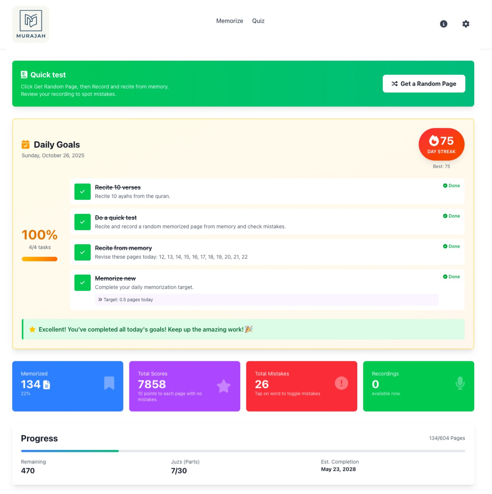
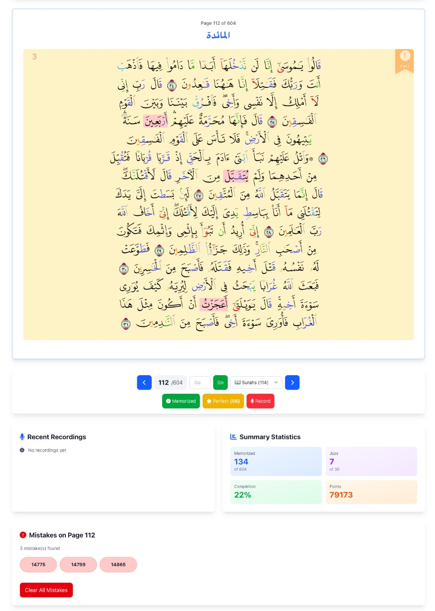
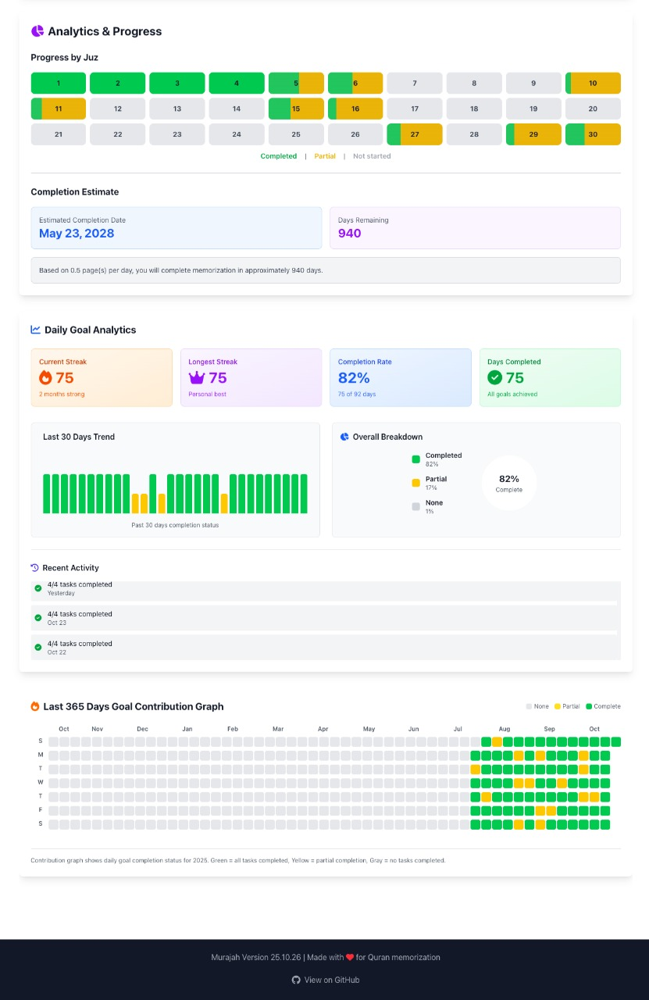
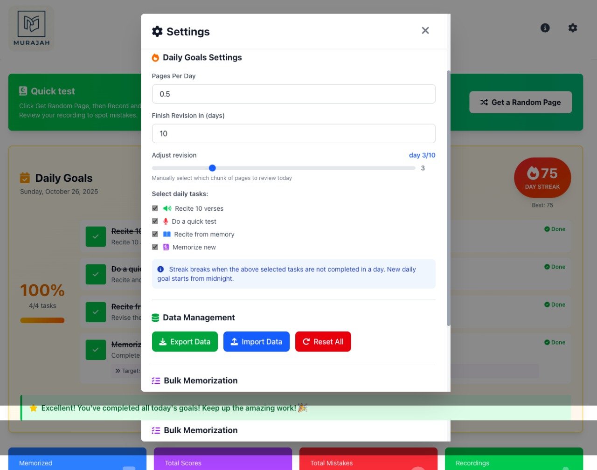

<p align="center"></p>

# Murajah - Quran Memorization & Revision Tool

<p align="center"></p>
<p align="center"></p>
<p align="center"></p>

## 📖 What is Murajah?

**Murajah** (مراجعة) is a comprehensive application designed to help Quran students memorize and maintain their memorization through systematic review and practice.

### The Meaning of Murajah

In Arabic, "muraja'ah" means **review, revision, or repetition**. In the context of Quranic studies, it specifically refers to the practice of repeatedly reciting and revising previously memorized verses to prevent forgetting them.

- **General meaning**: Review, revisiting, or revising something
- **Specific meaning in Quranic studies**: The essential act of repeating and reviewing already memorized portions of the Quran to maintain them

This practice is fundamental to Quran memorization, as it helps prevent memorization from deteriorating over time.

## 🎯 Why Murajah is Important

Memorizing the Quran is a profound spiritual journey, but maintenance is equally critical. Murajah addresses this by:

- **Preventing Forgetting**: Regular revision ensures memorization stays fresh and long-term
- **Tracking Progress**: Monitor what you've memorized and areas needing improvement
- **Building Accountability**: Daily goals and statistics keep you motivated
- **Identifying Weaknesses**: Track mistakes to focus on challenging verses
- **Structured Learning**: Organized review schedules optimize retention

## ✨ Key Features

### 📱 Dashboard

- Overview of your memorization progress
- Daily statistics and achievements
- Visual progress indicators

### 📖 Quran Page Viewer

- Full Quran text with proper formatting and Tajweed rules highlighting
- Page-by-page navigation matching the standard Quran (Madinah Mushaf)
- Word-by-word translation and meanings
- Customizable text size (Small, Medium, Large)

### 🎙️ Audio Playlist

- Record your recitations
- Listen back to your recordings to identify mistakes
- Manage multiple recordings

### 🎓 Quiz Mode

- Interactive quizzes based on selected surah
- Multiple question types:
  - Word completion
  - Verse continuation
  - Verse Translation
  - Lightning modes
- Real-time score

### 📝 Memorized Grid

- Visual grid display of memorized Juz
- Color-coded memorization status
- Quick access to any memorized content
- Progress overview at a glance

### ❌ Mistake Tracker

- Mark mistakes
- Statistics on mistakes

### ⚙️ Settings
<p align="center"></p>

- Text size preferences
- Tajweed rules display toggle
- Data export and backup options

### 📊 Status Indicators

- Real-time progress metrics
- Memorization completion percentage
- Daily goal tracking
- Streak counter
- Achievement badges

### 🧭 Navigation

- Keyboard shortcuts (Press H for more information)
- Intuitive menu system
- Quick links to all features
- Surah (chapter) selection
- Jump to page functionality
- Random memorized page

## 🚀 Getting Started

### Prerequisites

- A modern web browser (Chrome, Firefox, Safari, Edge)
- Internet connection

### Installation & Self-Hosting

#### Option A: GitHub Pages (Recommended for Personal Use)

1. **Fork or Clone the Repository**

   ```bash
   git clone https://github.com/wasi0013/Murajah.git
   cd Murajah
   ```

2. **Enable GitHub Pages**
   - Go to your repository settings
   - Navigate to "Pages" section
   - Select `master` branch as the source
   - Select `/source` as the folder
   - Save

3. **Access Your App**
   - Your app will be available at: `https://yourusername.github.io/Murajah/`

**Note**: Data is stored locally in your browser, so it persists across sessions on the same device.

#### Option B: Cloudflare Pages (Advanced Deployment)

1. **Prerequisites**
   - Cloudflare account (free tier available)
   - GitHub account with the Murajah repository

2. **Connect Cloudflare to GitHub**
   - Log in to [Cloudflare Dashboard](https://dash.cloudflare.com/)
   - Navigate to "Pages" section
   - Click "Create a project"
   - Select "Connect to Git"
   - Authorize and select your Murajah repository

3. **Configure Build Settings**
   - **Production branch**: `master`
   - **Build command**: Leave empty (no build step needed)
   - **Build output directory**: `source`

4. **Deploy**
   - Save and deploy
   - Your app will be available at a Cloudflare-provided URL
   - You can add a custom domain if you own one

5. **Access Your App**
   - Visit your Cloudflare Pages URL
   - Navigate to `index.html` or the root URL

**Benefits of Cloudflare Pages**:

- Global CDN for faster loading
- Free HTTPS/SSL
- Automatic deployments on git push
- More reliable than GitHub Pages
- Option to add custom domain

### Local Development

1. Clone the repository:

   ```bash
   git clone https://github.com/wasi0013/Murajah.git
   ```

2. Navigate to the source directory:

   ```bash
   cd Murajah/source
   ```

3. Start a local server (choose one):

   ```bash
   # Python 3
   python3 -m http.server 8000
   
   
   # Or with Node.js (http-server)
   npx http-server
   ```

4. Open your browser and visit:

   ```bash
   http://localhost:8000/index.html
   ```

## 💾 Data Management

### Local Storage

- All your data (memorization progress, mistakes, bookmarks, recordings) is stored locally in your browser
- **Important**: Data is specific to each browser and device
- Regular backups are recommended

### Data Export

- Use the Settings panel to export your progress as JSON
- Keep backups on your computer or cloud storage

### Data Privacy

- ✅ No server-side storage
- ✅ No tracking or analytics
- ✅ All data remains on your device
- ✅ Completely private and secure

## 🏗️ Project Structure

```plaintext
Murajah/
├── source/
│   ├── index.html              # Main application
│   ├── quiz.html               # Quiz mode interface
```

## 🛠️ Technology Stack

- **Frontend Framework**: Vue.js 3
- **Styling**: Tailwind CSS
- **Icons**: Line Awesome
- **Data Format**: JSON
- **Storage**: Browser LocalStorage (IndexedDB)
- **Fonts**: Custom Quran fonts for proper Tajweed display

## 📚 Features Deep Dive

### Tajweed Rules Highlighting

The app displays Quranic text with proper Tajweed (rules of recitation) highlighting, making it easier to learn correct pronunciation and recitation rules. (Press T to toggle)

### Audio Recording

Record your own recitations and compare them with standard recordings to improve your delivery. (Press R)

### Progress Analytics

Track your memorization journey with detailed statistics on:

- Daily/weekly/monthly progress
- Mistakes tracking per page
- Statistics

## 🤝 Contributing

Found a bug or have a feature request? Feel free to:

1. Open an issue on GitHub
2. Submit a pull request with improvements
3. Share your feedback

## 📄 License

This project is open-source and available for personal use. Please check the LICENSE file for detailed terms.

## 🤖 AI Development Disclosure

**Important Note**: This project in its entirety is developed and debugged using **Agentic Coding**:

- **Claude Haiku 3.5**
- **Claude Sonnet 3.5**

The application was built using advanced AI models to plan, design, implement, debug, optimize, and refine the codebase.

## 📞 Support

For questions, issues, or suggestions:

1. Check existing issues on GitHub
2. Create a new issue with detailed description
3. Include your browser and device information

## 🙏 Acknowledgments

- Quran data sourced from [https://github.com/TarteelAI/quranic-universal-library](https://github.com/TarteelAI/quranic-universal-library)
- Tajweed font is also from quran.com

---

## 🌟 Start Your Journey

Start your memorization journey with Murajah today! Make review easy, systematic, and rewarding. 📖✨
May Allah accept your efforts in memorizing and preserve **His Words** in your heart. 🤍

> May Allah bless all the JSON resource providers and quran.com team.
