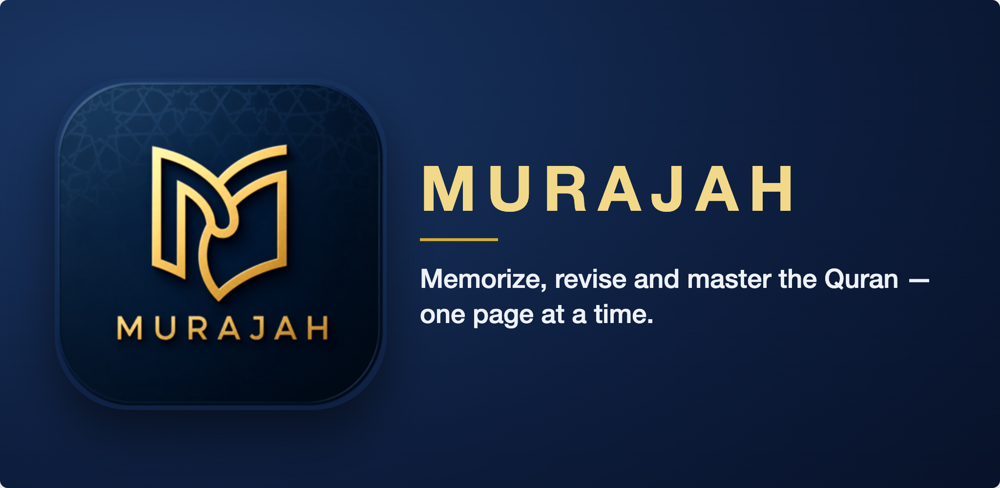

<p align="center"><a href="https://murajah.pages.dev/download/"></a></p>

# Murajah - Quran Memorization & Revision Tool

[](https://murajah.pages.dev/download/)
[](https://github.com/wasi0013/Murajah/releases)

[](https://play.google.com/store/apps/details?id=com.murajah.webview)
[](https://murajah.pages.dev/download/)
[](https://github.com/wasi0013)
[](./LICENSE)


<p align='center'><a href="https://youtu.be/0_FSN7e0qxw"></a></p>

## 📖 What is Murajah?

**Murajah** (مراجعة) is a comprehensive application designed to help Quran students memorize and maintain their memorization through systematic review and practice.

### The Meaning of Murajah

In Arabic, "muraja'ah" means **review, revision, or repetition**. In the context of Quranic studies, it specifically refers to the practice of repeatedly reciting and revising previously memorized verses to prevent forgetting them.

- **General meaning**: Review, revisiting, or revising something
- **Specific meaning in Quranic studies**: The essential act of repeating and reviewing already memorized portions of the Quran to maintain them

This practice is fundamental to Quran memorization, as it helps prevent memorization from deteriorating over time.

## 🎯 Why Murajah is Important

Memorizing the Quran is a profound spiritual journey, but maintenance is equally critical. Murajah addresses this by:

- **Preventing Forgetting**: Regular revision ensures memorization stays fresh and long-term
- **Tracking Progress**: Monitor what you've memorized and areas needing improvement
- **Building Accountability**: Daily goals and statistics keep you motivated
- **Identifying Weaknesses**: Track mistakes to focus on challenging verses
- **Structured Learning**: Organized review schedules optimize retention

## ✨ Key Features

### 📖 Three Reading Surfaces

- **Madani (QPC) Mushaf** — Uthmani script with full color-coded tajweed and a legend, toggleable
- **Indopak Nastaleeq** — a first-class layout for the subcontinent tradition, not an afterthought
- **Mushaf (scanned pages)** — the real printed-page feel: single page on phones, a true 2-page spread on desktop, pinch-to-zoom throughout
- Adjustable text size, plus light / dark / sepia reading themes with full RTL support

### 🔤 Word-Level Tools

- Word-by-word translation
- Tap-to-inspect **morphology** — full Arabic grammar breakdown per word
- **Mistake-marking mode** to flag and revisit the words you keep missing

### 📜 Tafsir

- Inline commentary in Arabic, English, and Bengali — toggle per page without leaving the reader

### 📊 Memorization & Analytics

- Color-coded memorized-page grid and Juz-level progress overview
- Per-page perfect-revision counters and a weakness score that surfaces pages needing review
- A page-by-page revision heatmap and a **completion estimate** — a projected finish date based on your pace

### 🗓️ Adaptive Daily Plans

- One adaptive plan combining scope, pace, and new-memorization targets — not a static checklist
- Smart, weakness-aware scheduling
- A daily "Today" view with streaks (midnight reset) and full history

### ❓ Quiz Mode

- Translation matching, verse continuation, and word completion
- Scoped to any surah, juz, or range, scored in real time

### 🔊 Audio & Recitation

- 14 verse-by-verse reciters and 11 page-level reciters, with automatic fallback sourcing
- Record your own recitation and play it back for self-review
- **Listen** mode — continuous playback of a surah, juz, or the entire Quran
- **Live** — 24/7 streams from Makkah and Madinah

### 🧭 Navigation

- Friendly, shareable URLs (`/2` opens Al-Baqarah, `/page/50`, `/mushaf/50`)
- A Contents browser with Surah / Juz / Page views
- A command palette (`⌘K` / `Ctrl+K`) for instant quick-jump
- A responsive shell — a bottom tab bar on mobile, a full navigation rail on desktop

### 📲 Installable

- Installs as a real Progressive Web App on Android, iOS, and desktop
- An iOS-safe service worker that avoids the stale-cache issues common to WebKit PWAs

### 🔒 Data & Privacy

- 100% local-first — everything lives in your browser's IndexedDB; no account, no backend, nothing tracked
- Export and import your entire history as a single JSON file, anytime

### 🌍 Multi-language

- Full UI localization in English, Arabic, and Bengali

## 🚀 Getting Started

### Try It Now
- 🍰 **Demo**: [Checkout some of the features](https://murajah.pages.dev/download)
- 🌐 **Web app:** [murajah.pages.dev](https://murajah.pages.dev/)
- 📱 **Android:** [Get it on Google Play](https://play.google.com/store/apps/details?id=com.murajah.webview)

### Prerequisites

- [Node.js](https://nodejs.org/) 22 or later
- npm

### Local Development

```bash
git clone https://github.com/wasi0013/Murajah.git
cd Murajah/app
npm install
npm run dev
```

The dev server regenerates the Quran data chunks automatically and starts at `http://localhost:5173`.

### Production Build

```bash
cd app
npm run build      # type-check + production build → dist/ (incl. the PWA service worker)
npm run preview    # serve the production build locally
```

### Deployment

The app builds to a static bundle (`app/dist`) that runs anywhere capable of serving static files with SPA-fallback routing (see `app/public/_redirects`). It's currently deployed on **Cloudflare Pages** with zero backend servers. Full deploy configuration lives in [`app/README.md`](app/README.md).

## ✅ Running Tests

```bash
cd app
npm install
npm run test:unit                        # Vitest — domain logic, stores, components
npx playwright install --with-deps chromium
npm run test:e2e                         # Playwright — full user flows + accessibility
npm test                                 # both
```

Useful variants:

```bash
npm run test:unit:watch        # unit tests, watch mode
npm run test:unit:coverage     # unit test coverage report
npm run size                   # bundle-size budget gate
```

Every pull request runs type-checking, the full unit + e2e suite, a bundle-size gate, and a Lighthouse CI performance budget via GitHub Actions.

## 💾 Data Management

- All progress — memorization, mistakes, plans, streaks, recordings — is stored locally in **IndexedDB**. Nothing is ever sent to a server.
- Data is per-browser and per-device; use **Settings → Export/Import** to back it up or move it between devices.

## 🏗️ Project Structure

```plaintext
Murajah/
├── app/               # The application (Vue 3 + Vite + TypeScript)
│   ├── src/
│   │   ├── core/          # Framework-agnostic domain logic (memorization, storage, audio, i18n…)
│   │   ├── stores/        # Pinia stores
│   │   ├── components/    # Shared UI primitives
│   │   ├── features/      # One folder per feature — reader, quiz, audio, progress, settings…
│   │   ├── router/        # Code-split routes
│   │   ├── workers/       # Off-main-thread data parsing
│   │   └── sw/            # Service worker (Workbox via vite-plugin-pwa)
│   ├── tests/         # Vitest unit tests + Playwright e2e specs
│   └── public/        # Static assets, PWA icons, SPA redirects
├── data-pipeline/     # Build-time scripts: chunk & compress Quran/tafsir/morphology data, fonts, images
└── plans/             # Design & implementation planning docs
```

## 🛠️ Technology Stack

- **Framework**: Vue 3 (`<script setup>` + TypeScript), Vite
- **State**: Pinia
- **Routing**: Vue Router, fully code-split
- **Styling**: Tailwind CSS v4, compiled at build time — no runtime JIT
- **Icons**: Lucide, tree-shaken SVGs
- **Offline**: vite-plugin-pwa (Workbox) + IndexedDB
- **Testing**: Vitest (unit), Playwright (e2e + accessibility via axe-core)
- **Performance gates**: size-limit (bundle budgets) + Lighthouse CI, enforced on every PR
- **Hosting**: Cloudflare Pages — static, no backend servers

## ⌨️ Keyboard Shortcuts

| Key | Action |
| --- | --- |
| `←` / `→` | Previous / next page (mirrors reading direction) |
| `Page Up` / `Page Down` | Previous / next page |
| `⌘K` / `Ctrl+K` | Open quick-jump — surah, ayah, page, or juz |

## 🤝 Contributing

Found a bug or have a feature request?

1. Open an issue on GitHub
2. Submit a pull request with improvements
3. Share your feedback

## 📄 License

This project is licensed under **GNU GPL v3.0**. See [LICENSE](/LICENSE) for full terms.

## 📞 Support

1. Check existing issues on GitHub
2. Open a new issue with a clear description, including your browser and device
3. Or join the [Discord community](https://discord.gg/Vycfm28anP)

## 🙏 Acknowledgments

- Quran text, tafsir, and morphology data from the [Quranic Universal Library (QUL)](https://github.com/TarteelAI/quranic-universal-library)
- Tajweed-colored font from [quran.com](https://quran.com)

---

## 🌟 Start Your Journey

Start your memorization journey with Murajah today — make review easy, systematic, and rewarding. 📖✨
May Allah accept your efforts in memorizing and preserve **His Words** in your heart. 🤍

> May Allah bless all the JSON resource providers and the quran.com team.
